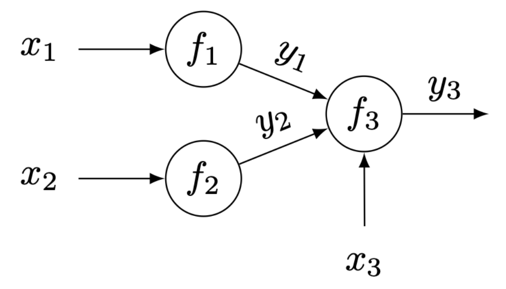

### Bayesian Optimization of Function Networks with Partial Evaluations
This repository contains the code implementations for Bayesian Optimization of Function Networks with Partial Evaluations (pKGFN) and its accelerated version (fast_pKGFN).

The pKGFN algorithm is detailed in the paper "Bayesian Optimization of Function Networks with Partial Evaluations," accepted at [ICML2024](https://proceedings.mlr.press/v235/buathong24a.html)[1]. The accelerated version is described in "Fast Bayesian Optimization of Function Networks with Partial Evaluations," available on [ArXiv](..)[2].

## Brief overview
Bayesian Optimization (BO) [3,4] is an optimization framework used to solve problems of the form
<div align="center">
  
</div>

where $$f(x)$$ is an expensive-to-evaluate black-box function.

BO framework consists of two main components
- Surrogate model: used for approximating the objective function $$f(x)$$ and
- Acquisition function: constucted upon the fitted surrogate model and used for evaluating benefits of performing an additional evaluation at any input $$x\in\mathcal{X}$$.

BO begins with an initial set of $n$ observations $D\_n=\{(x\_i,f(x\_i))\}\_{i=1}^n$. Then it fits a surrogate model using this dataset. Next, it constructs an acquisition function based on the fitted model and optimizes it to get the most promising candidate input $$\hat{x}$$. Subsequently, it evaluates at the suggested input and obtains the function value $$f(\hat{x})$$. The newly obtained data point $$(\hat{x},f(\hat{x}))$$ is then appended to the observation set. This process repeats until budget depletion.

Bayesian Optimization of Function Networks (BOFN) [5] is an advanced BO framework designed to solve optimization problems whose objective functions can be constructed as a network of functions such that outputs of some nodes serve as parts of inputs for another.


Figure 1: An example of function networks

For example, Figure 1 shows a function network arranged as a directed acyclic graph (DAG), consisting of three function nodes $$f\_1,f\_2$$ and $$f\_3$$. It takes a vector $$x$$ of three variables $$x\_1,x\_2$$ and $$x\_3$$ as a function network input. Evaluating $$f\_1$$ at $$x\_1$$ yields an intermediate output $$y\_1$$. Similarly, evaluating $$f\_2$$ at $$x\_2$$ gives an intermediate output $$y\_2$$. To evaluate $$f\_3$$, it takes the two intermediate outputs $$y\_1$$ and $$y\_2$$ together with an additional parameter $$x\_3$$ and returns the final output $$y\_3$$. For this problem, one aims to find an optimization solution $$x\^*$$ that yields highest value of final output $$y\_3$$. Evaluating the network at any network input $$x$$ gives not only the final output $$y\_3$$, but also the two intermediate outputs $$y\_1$$ and $$y\_2$$.

In [5], the surrogate model for a function network and a novel acquisition function named the *Expected Improvement of Function Networks* (EIFN) which leverages these intermediate outputs and it has shown significant optimization performance improvement.

Recently, [1]  has extended the BOFN framework to function networks where nodes can be queried independently and they incur differnt positive evaluation costs. Using Figure 1 as example, in this setting, one can decide to evaluate $$f\_1$$ at $$x\_1$$ with paying the cost $$c\_1(x\_1)$$. Once the observation $$y\_1$$ is observed, one can decide based on the $$y\_1$$ value to either (1) continue evaluating $$f\_3$$ at this $$y\_1$$ together with some $$y\_2$$ obtained from evaluating $$f\_2$$ at some $$x\_2$$ and some additional $$x\_3$$ if it looks promising or (2) restart the process, evaluating $$f\_1$$ at some other inputs. In order to make a decision, [1] used the same surrogate model as considered in [5] and proposed an acquisition function named the *Knowledge Gradient of Function Networks with Partial Evaluations* (pKGFN) which decides a node and its corresponding input to evaluate in each iteration in a cost-aware manner. This acquisition function does not have an analytical formula, requiring its computations to rely on costly Monte-Carlo approximation. Moreover the acquisition function is specific to each node and in order to make a decision on which node to evaluate, one has to loop through all nodes and solves acquisition function problems separately. This further compounds the computational challenges of pKGFN.

To address these computational challenges, [2] recently proposed a faster-to-evaluate variant of pKGFN (Fast pKGFN) which requires solving only one acquisition function problem at each iteration. It leverages the use of EIFN [5] together with simulated intermediate outcomes from the fitted surrogate model to form a propose-to-evaluate candidate input for each individual node. These candidates are compared by using pKGFN acquisition function [1] in a cost-aware manner and there is only one node and its corresponding input are selected to evaluate in each iteration. Fast pKGFN has proven to have a competitive optimization performance to the original pKGFN, but significantly reduce the runtime by up to $$16\times$$ according to numerical experiments tested and reported in the paper.

## Contents
This repository contains partial_kgfn and results folders.

- partial_kgfn consists of the following folders and files:
1. acquisition -- acquisition function files
    - FN_realization.py -- an AcquisitionFunction class used to sample a network realization from a function network model
    - full_kgfn.py -- an MCAcquisitionFunction class used to compute the knowledge gradient for function network acquisition function with full evaluations
    - partial_kgfn.py -- an MCAcquisitionFunction class used to compute the knowledge gradient for function network acquisition function with partial evaluations
    - tsfn.py -- an AcquisitionFunction class used to compute the Thompson Sampling acquisition function
2. experiments -- runner files for the two test case problems
    - ackleyS_runner.py -- a main file to run Ackley problem
    - ackmat_runner.py -- a main file to run AckMat problem
    - freesolv3_runner.py -- a main file to run FreeSolv3 problem
    - GPs1_runner.py -- a main file to run GP test problem #1
    - GPs2_runner.py -- a main file to run GP test problem #2
    - manufacturing_runner.py -- a main file to run Manu problem
3. model -- gaussian process model for function network
    - dag.py -- a DAG object
    - decoupled_gp_network.py -- a model class for function network
4. optim -- codes to support acquisition function optimization
    - discrete_kgfn_optim.py -- a file containing optimization function used to solve partial_kgfn acquisition function
5. test_functions -- test problems
    - ack_mat.py -- a SyntheticTestFunction class for AckMat problem
    - ackley_sin.py -- a SyntheticTestFunction class for Ackley problem
    - freesolv3.py -- a SyntheticTestFunction class for FreeSolv3 problem
    - GPs1.py -- a SyntheticTestFunction class for GP test problem #1
    - GPs2.py -- a SyntheticTestFunction class for GP test problem #2
    - manufacter_gp.py -- a SyntheticTestFunction class for manufacturing problem
    - pharmaceutical.py -- a SyntheticTestFunction class for pharma problem
    - freesolv_NN_rep3dim.csv -- a data file to construct a FreeSolv problem
6. utils -- utilities functions
    - construct_obs_set.py -- code for constructing observation set according to the DAG of the problem
    - EIFN_optimize_acqf.py -- code for optimizing EIFN acquisition function 
    - gen_batch_x_fantasies.py -- code for generate X fantasies for discrete acquisition functions including fullKGFN and partialKGFN
    - posterior_mean.py -- code for computing posterior mean of the network final node's output
7. run_one_trial.py -- code for running one trial of Bayesian Optimization

- results folder is created to store saved models and optimization results.

## Example code
run_experiment.ipynb is a notebook used to run a problem. 

- First cell: Call a problem runner

- Second cell: Call the loaded problem class and run a BO trial. The following attributes are required to be specified:
    - trial -- trial number (int)
    - algo -- algorithm name (str): options are "EI", "KG", "Random", "EIFN", "KGFN", "TSFN", "pKGFN", "fast_pKGFN" (Our method)
    - cost -- evaluation cost configuration (str): This should be in the format of "node1cost_node2cost_node3cost_..._nodeKcost"
    - budget -- BO evaluation budget (int)
    - noisy -- a boolean variable indicating if the observations are noisy.
    - impose_assump -- a boolean variable indicating if the upstream-downstream restriction is imposed. If "True", to evaluate downstream nodes, its parent nodes' outputs have to be obtained beforehand. 
**To use fast_pKGFN, impose_condition is needed to set to False.**

**Note: fast_pKGFN can be used to solve all problems, but pharma due to its incompatible structure, making fast_pKGFN boil down to a standard EIFN in this specific problem**
## Software requirements
The entire codebase is written in python. Package requirements are as follows:
  - python=3.9
  - botorch==0.8.4
  - numpy==1.23.5
  - gpytorch==1.10
  - scipy==1.10.1
  - pandas
  - matplotlib
  - jupyter

The corresponding environment may be created via conda and the provided pKGFN_evn.yml file as follows:
```
  conda env create -f pKGFN_evn.yml
  conda activate pKGFN_evn
```

## References
[1] Buathong, Poompol, et al. "Bayesian Optimization of Function Networks with Partial Evaluations." International Conference on Machine Learning. PMLR, 2024.

[2] Buathong, Poompol and Frazier, Peter I. "Fast Bayesian Optimization of Function Networks with Partial Evaluations." ArXiv

[3] Jones, Donald R., Matthias Schonlau, and William J. Welch. "Efficient global optimization of expensive black-box functions." Journal of Global optimization 13 (1998): 455-492.

[4] Frazier, Peter I. "Bayesian optimization." Recent advances in optimization and modeling of contemporary problems. Informs, 2018. 255-278.

[5] Astudillo, Raul, and Frazier, Peter I. "Bayesian optimization of function networks." Advances in neural information processing systems 34 (2021): 14463-14475.
